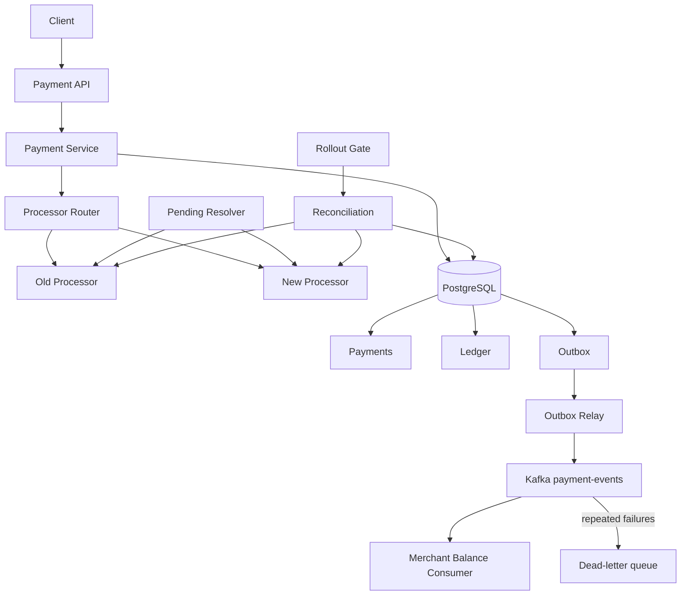

# PaymentCutoverSimulator
Simulates a live card-processor migration in Java/Spring Boot: staged rollout gated by reconciliation, instant rollback, and no double charges under injected timeouts and crashes.


A Java and Spring Boot project that simulates one of the riskiest jobs in payments: **switching from one card processor to another while the system is live.**

Traffic moves from an old processor to a new one in small steps. Each step is allowed only if reconciliation proves the new processor is clean. Rollback is always one call away.

Throughout the migration, the system is hit with timeouts, crashes and retries. The goal is simple:

```text
no customer charged twice
no charge lost
no silent drift between our records and the processor's
```

## Highlights

- Gradual migration: 5% → 25% → 50% → 100% of merchants
- Rollout gates that block on reconciliation problems
- Instant rollback that never strands a payment
- Two fake processors with different guarantees
- Timeouts treated as *unknown*, never as *failed*
- Idempotency keys on every write
- Double-entry ledger
- Reconciliation against each processor's records
- Transactional outbox and Kafka events
- Idempotent Kafka consumer with a dead-letter queue
- Failure injection and Testcontainers integration tests

---

## Why I built this

>I've spent my career building backend and distributed systems in financial settings, but I'd never owned the part where money actually moves. When I looked at payments engineering roles, the same questions kept coming up: what happens when a processor times out, how do you avoid charging twice, how do you switch providers safely? I wanted to answer them by building something, not just reading about them, so I picked the riskiest change I could think of and tried to break it.

---

## The problem

For a few weeks, both processors are live at the same time:

```text
merchants 0–24  ──► NEW processor     (rejects duplicate captures)
merchants 25–99 ──► OLD processor     (charges again if asked twice)
```

The old processor has no duplicate protection. So if our service retries a capture it shouldn't, the customer pays twice.

The hardest case:

```text
Our service
    |
    | capture €100
    v
Processor
    |
    | capture succeeds
    |
    X response lost (timeout)
```

The money moved, but we didn't hear back. Two naive reactions are both wrong:

```text
retry the capture   →  customer charged twice
mark it as failed   →  customer charged, our records say "failed"
```

---

## The answer: treat a timeout as *unknown*

```text
timeout
   |
   v
CAPTURE_PENDING   ("we asked, we don't know yet")
   |
   v
ask the processor: "did you capture payment 42?"
   |
   +── yes, €100 ───► CAPTURED  (record it, post to the ledger)
   |
   +── never saw it ► safe to send the capture again
   |
   +── no answer ───► wait and ask again later
```

We **never** send a capture again until the processor tells us it never received the first one.

---

## Results

> 🚧 **Work in progress:** step 2 of 9 done (setup). See the [build plan](docs/DESIGN.md#build-order).
### 1. The migration run

`./gradlew migrate` runs a full migration through the real API. Partway through, a bug is switched on in the new processor to prove the gate stops the rollout.

```text
step  rollout    gate         what happened
 1    0 → 5%     ✅ pass
 2    5 → 25%    ✅ pass
 3    25%        —            bug switched on: NEW captures 1 cent less on ~1% of payments
 4    25 → 50%   ⛔ BLOCKED   reconciliation found TODO amount mismatches on NEW
 5    25%        —            bug fixed, mismatches resolved by an operator
 6    25 → 50%   ✅ pass
 7    50 → 0%    (always ok)  ROLLBACK with TODO payments in flight on NEW
 8    0%         —            all TODO in-flight payments finished on NEW, 0 stranded
 9    0 → 100%   ✅ pass       stepped back up to 100%

Totals: TODO payments · duplicate charges: 0 · lost charges: 0 · ledger balanced ✅ · Kafka drift: 0
```

### 2. Safe vs naive

`./gradlew simulate` sends 10,000 payments with 5% timeouts. It runs twice: once with the safe design, and once with a naive version that blindly retries.

| Metric | Safe | Naive |
|---|---:|---:|
| Duplicate charges | TODO (expect 0) | TODO (expect > 0) |
| Lost charges | TODO (expect 0) | TODO |
| Unknown outcomes resolved | TODO | — |
| Problems found by reconciliation | TODO | TODO |
| Capture latency p50 / p95 | TODO | TODO |

The naive run is the control. It proves the tests and reconciliation really do catch double charges when the protection is missing.

---

## Architecture



### Payment lifecycle

```text
AUTHORIZED
   |
   v
CAPTURE_PENDING   (asked the processor, waiting for the answer)
   |
   v
CAPTURED
   |
   v
SETTLED
```

A declined authorization goes to `FAILED`.

---

## Migration

**Routing.** Each merchant gets a fixed number from 0 to 99:

```text
bucket = hash(merchantId) % 100
bucket < rolloutPercent  →  NEW processor
otherwise                →  OLD processor
```

Raising the percentage only adds merchants. A merchant never flips back and forth.

**Sticky payments.** A payment stays on the processor it was authorized on, even if the rollout changes.

**Gates.** Moving the rollout *up* is allowed only if:

```text
reconciliation ran in the last hour
0 unresolved problems on NEW
NEW capture failure rate < 1%
no stuck pending payments on NEW
```

Otherwise the API returns `409` with the reason.

**Rollback.** Moving the rollout *down*, even to 0%, is always allowed. Payments already on NEW finish on NEW.

---

## Idempotency

Every write needs an `Idempotency-Key` header.

```text
same key, same request       →  return the original answer
same key, different request  →  422 error
same key, still in progress  →  409, try again shortly
```

The key is saved in the same database transaction as the payment change, so two identical requests can never both get through.

---

## Double-entry ledger

A €100 capture:

```text
DEBIT   PROCESSOR_RECEIVABLE:NEW   €100
CREDIT  MERCHANT_PAYABLE           €100
```

Settlement, when the processor pays out:

```text
DEBIT   SETTLEMENT_CASH            €100
CREDIT  PROCESSOR_RECEIVABLE:NEW   €100
```

Every journal must balance: total debits = total credits. Entries are never edited, only added.

---

## Reconciliation

Reconciliation compares our records with each processor's records and names every difference:

| Problem | Meaning | Fixed automatically? |
|---|---|---|
| `MISSING_INTERNAL` | Processor captured it, we didn't record it | Yes |
| `MISSING_AT_PROCESSOR` | We recorded it, processor has no capture | No |
| `DUPLICATE_AT_PROCESSOR` | Two captures for one payment | No |
| `AMOUNT_MISMATCH` | Amounts differ | No |
| `STALE_PENDING` | Unknown for more than 15 minutes | No |
| `LEDGER_IMBALANCE` | Books don't balance | No |
| `PROJECTION_DRIFT` | Kafka-built balance ≠ ledger | No |

Only one case is fixed automatically, because it has one safe answer: ask the processor and record what it says. Everything else needs a human, because reconciliation should **find** problems, not quietly move money.

---

## Kafka events

Writing to the database and then publishing to Kafka can go wrong:

```text
database commit succeeds
        |
        X crash
Kafka publish never happens   →  event lost
```

So the event is written to an **outbox** table in the same transaction as the payment change:

```text
one transaction
   |
   +── payment → CAPTURED
   +── ledger entries
   +── outbox event
   |
COMMIT
```

A relay then sends outbox events to Kafka. Events can arrive twice, so the consumer remembers which event IDs it has handled:

```text
event already seen?   →  skip it
event older than what we have?   →  skip it
fails 3 times?   →  send to the dead-letter queue
```

Kafka carries **facts that already happened**. It never carries commands that move money.

---

## Failure tests

Each row is an integration test against real Postgres and Kafka (Testcontainers).

| # | What we break | What must happen |
|---|---|---|
| S1 | Nothing | Payment settles, books balance |
| S2 | **Timeout after capture, client retries** | One capture only |
| S3 | Timeout after capture on the old processor | Resolver finishes it, no duplicate |
| S4 | Two identical requests at once | One goes through, the other gets 409 |
| S5 | Same key, different amount | 422 |
| S6 | Processor fails before capturing | Retry later captures once |
| S7 | Crash after capture, before we save | Reconciliation finds and fixes it |
| S8 | Rollback with payments in flight | Nothing stranded |
| S9 | Raise rollout with open problems | 409, blocked |
| S10 | Amount corrupted | Flagged, not auto-fixed |
| S11 | Naive blind retry (control) | Duplicates happen and are caught |
| S12 | Full migration run | Blocked by the bug, then reaches 100% |
| S13 | Every Kafka event sent twice | Applied once |
| S14 | Old event arrives after a newer one | Ignored |
| S15 | Broken Kafka event | Goes to the DLQ, flagged by reconciliation |

---

## Rules the system never breaks

1. One idempotency key means at most one effect.
2. A timeout is never treated as a failure.
3. A capture is never re-sent until the processor confirms it never got the first one.
4. No database transaction stays open during a call to a processor.
5. Every ledger journal balances.
6. Payment change, ledger entries and outbox event commit together, or not at all.
7. A payment stays on the processor it started on.
8. The rollout only moves up when reconciliation is clean.
9. Rollback is always allowed.
10. Kafka consumers handle duplicate and out-of-order events.

---

## Running locally

**You need:** Java 21 and Docker.

```bash
docker compose up -d     # starts Postgres and Kafka
./gradlew test           # runs all failure tests
./gradlew bootRun        # API on http://localhost:8080
./gradlew migrate        # full migration run
./gradlew simulate       # safe vs naive run
```

### Try the timeout case by hand

```bash
# Make the new processor time out after capturing
curl -X PUT localhost:8080/admin/failures/NEW -H 'Content-Type: application/json' \
  -d '{"mode":"TIMEOUT_AFTER_SUCCESS","rate":1.0}'

# Authorize a payment
curl -X POST localhost:8080/payments -H 'Idempotency-Key: auth-1' -H 'Content-Type: application/json' \
  -d '{"merchantId":"m-new-1","amount":10000,"currency":"EUR"}'

# Capture → 202 CAPTURE_PENDING
curl -X POST localhost:8080/payments/<id>/capture -H 'Idempotency-Key: cap-1'

# Retry with the same key → 200 CAPTURED, and still only one capture at the processor
curl -X POST localhost:8080/payments/<id>/capture -H 'Idempotency-Key: cap-1'
```

---

## API

```http
POST /payments                         authorize (needs Idempotency-Key)
POST /payments/{id}/capture            capture
GET  /payments/{id}                    current state

PUT  /admin/rollout                    {"newPercent": 25}, 409 if a gate fails
PUT  /admin/failures/{processor}       failure injection
POST /admin/settlement/run             run settlement now
POST /admin/recon/run                  run reconciliation now
GET  /admin/recon/latest               latest problems found
POST /admin/recon/mismatches/{id}/resolve   operator marks a problem resolved, with a note
```

---

## Tech stack

- Java 21, Spring Boot 3
- PostgreSQL 16, Flyway, plain JDBC
- Apache Kafka, Spring Kafka
- JUnit 5, Testcontainers
- Docker Compose

---

## Not in scope

Refunds, partial captures, multiple currencies, real card networks, and authentication.

---

## Design decisions

Each decision has a short note explaining why:

- [ADR-0001: Idempotency keys](docs/adr/0001-idempotency-keys.md)
- [ADR-0002: Timeouts mean unknown](docs/adr/0002-delivery-semantics.md)
- [ADR-0003: No transaction during a processor call](docs/adr/0003-transactional-boundaries.md)
- [ADR-0004: Rollout gates and rollback](docs/adr/0004-cutover-gates-and-rollback.md)
- [ADR-0005: Kafka through an outbox](docs/adr/0005-kafka-via-transactional-outbox.md)

Build details (tables, build plan): [docs/DESIGN.md](docs/DESIGN.md)

---

## What this project explores

```text
What if the processor captures the money but the reply is lost?

What if the old processor charges twice when asked twice?

How do you move traffic to a new processor without risking everyone at once?

How do you know it's safe to move to the next step?

What happens to payments in flight when you roll back?

How do the books stay balanced?

What if Kafka delivers an event twice, or out of order?
```
